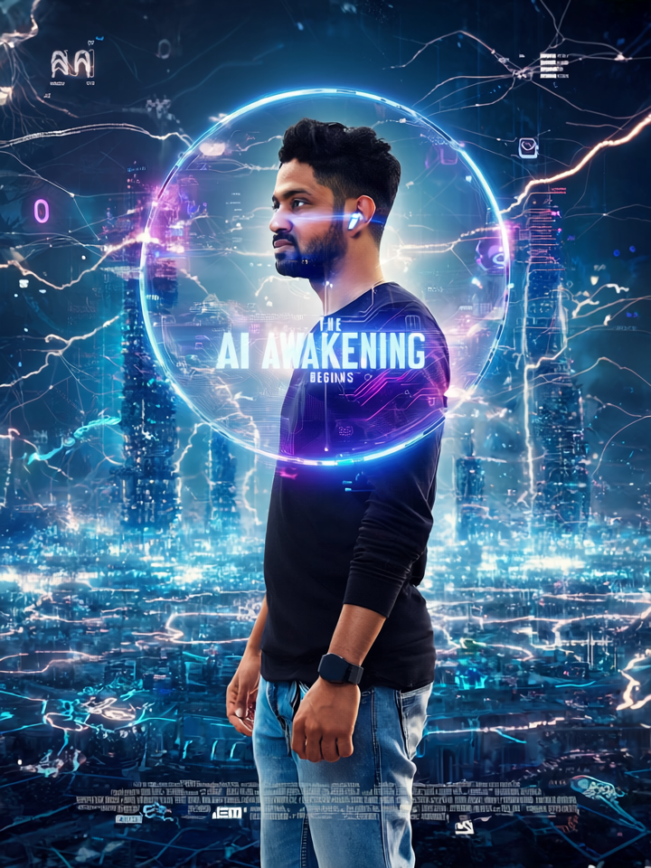

<!-- Navigation -->
<nav class="fixed top-0 left-0 w-full z-30 bg-white bg-opacity-70 backdrop-blur shadow-md px-6">
  

    <a href="#home" class="text-2xl font-bold text-blue-600">VeeruAI</a>
    <ul class="hidden md:flex space-x-8 text-gray-700">
      <li><a href="#about" class="hover:text-blue-600">About</a></li>
      <li><a href="#skills" class="hover:text-blue-600">Skills</a></li>
      <li><a href="#journey" class="hover:text-blue-600">Journey</a></li>
      <li><a href="#projects" class="hover:text-blue-600">Projects</a></li>
      <li><a href="#insights" class="hover:text-blue-600">Insights</a></li>
      <li><a href="#contact" class="hover:text-blue-600">Contact</a></li>
    </ul>
    <button class="md:hidden text-gray-700" onclick="menuToggle()">
      <svg class="w-6 h-6" fill="none" stroke="currentColor" viewBox="0 0 24 24">
        <path stroke-linecap="round" stroke-linejoin="round" stroke-width="2" d="M4 6h16M4 12h16M4 18h16" />
      </svg>
    </button>
  

  

    <a href="#about" class="block py-2">About</a>
    <a href="#skills" class="block py-2">Skills</a>
    <a href="#journey" class="block py-2">Journey</a>
    <a href="#projects" class="block py-2">Projects</a>
    <a href="#insights" class="block py-2">Insights</a>
    <a href="#contact" class="block py-2">Contact</a>
  

</nav>

<!-- Hero Section -->
<header id="home" class="hero h-screen flex items-center justify-center relative" style="background: url('assets/images/hero-bg.jpg') center/cover no-repeat;">
  

  

    <h1 class="text-5xl md:text-7xl font-bold mb-4">Building Tomorrow’s Enterprise Solutions</h1>
    
Java Microservices · GovTech Platforms · Generative AI Innovator

    <a href="#projects" class="inline-block px-8 py-3 bg-blue-600 rounded-full font-semibold hover:bg-blue-700 transition">View My Work</a>
  

</header>

<main class="pt-24 smooth-scroll font-['Inter'] bg-gray-50 text-gray-800">

<!-- About Me -->
<section id="about" class="max-w-6xl mx-auto px-6 py-16">
  

    
    

      <h2 class="text-4xl font-bold text-blue-600 mb-4">About Me</h2>
      
I’m <strong>Veeranjaneyulu Golakoti</strong>, an enterprise software leader with <strong>13+ years</strong> of experience architecting mission-critical Java microservices and government-scale platforms like ACRA.

      
As Associate Manager at Accenture Singapore, I design secure, scalable APIs with Spring Boot, enforce OAuth2/SAML2 standards, and streamline deployments on AWS ECS, Lambda, Azure, Kubernetes, and Docker.

      
Passionate about DevOps—Jenkins, Terraform IaC, zero-downtime strategies—and innovating with <strong>Generative AI</strong>: LLM bots, RAG workflows, and agentic systems for next-gen enterprise solutions.

      
Location: Singapore

    

  

</section>

<!-- Skills -->
<section id="skills" class="bg-gray-100 py-16">
  

    <h2 class="text-3xl font-bold text-center mb-12">Technical Expertise</h2>
    

      

        <h3 class="font-semibold mb-3">Languages & Frameworks</h3>
        <ul class="list-disc list-inside text-gray-700">
          <li>Java, Spring Boot, Hibernate, JPA, MyBatis</li>
          <li>Python (AI Prototyping), Node.js</li>
        </ul>
      

      

        <h3 class="font-semibold mb-3">Cloud & DevOps</h3>
        <ul class="list-disc list-inside text-gray-700">
          <li>AWS (ECS, Lambda, S3), Azure</li>
          <li>Docker, Kubernetes, Jenkins, Terraform</li>
        </ul>
      

      

        <h3 class="font-semibold mb-3">Security & Integration</h3>
        <ul class="list-disc list-inside text-gray-700">
          <li>OAuth2, SAML2, Spring Security</li>
          <li>REST & GraphQL APIs, Microservices</li>
        </ul>
      

      

        <h3 class="font-semibold mb-3">Generative AI</h3>
        <ul class="list-disc list-inside text-gray-700">
          <li>LLM Integration, RAG, Agentic Systems</li>
          <li>Prompt Engineering, Databricks Model Serving</li>
        </ul>
      

    

  

</section>

<!-- Professional Journey -->
<section id="journey" class="max-w-6xl mx-auto px-6 py-16">
  <h2 class="text-3xl font-bold text-center mb-12">Professional Journey</h2>
  

    

    

      
      <h4 class="text-lg font-semibold">Associate Manager, Accenture Singapore (2021 – Present)</h4>
      
Leading Java microservices & cloud teams, driving AI PoCs, and building DevOps pipelines.

    

    

      
      <h4 class="text-lg font-semibold">Senior Java Developer, Accenture Singapore (2018 – 2021)</h4>
      
Architected ACRA platform, optimized throughput, and enforced security standards.

    

    

      
      <h4 class="text-lg font-semibold">Java Developer, Accenture India (2012 – 2018)</h4>
      
Built enterprise integration solutions, financial services APIs, and performance tuning.

    

  

</section>

<!-- Projects -->
<section id="projects" class="bg-white py-16">
  

    <h2 class="text-3xl font-bold text-center mb-12">Featured Projects</h2>
    

      

        
        

          <h3 class="font-semibold mb-2">ACRA Regulatory Platform</h3>
          
High-throughput microservices for government regulatory workflows.

          <a href="#" class="text-blue-600 hover:underline">View Details →</a>
        

      

      

        
        

          <h3 class="font-semibold mb-2">Generative AI PoC</h3>
          
LLM integration for automated enterprise reporting.

          <a href="#" class="text-blue-600 hover:underline">View Details →</a>
        

      

      

        
        

          <h3 class="font-semibold mb-2">DevOps Pipeline Automation</h3>
          
Terraform + Jenkins for zero-downtime deployments.

          <a href="#" class="text-blue-600 hover:underline">View Details →</a>
        

      

    

  

</section>

<!-- Insights -->
<section id="insights" class="bg-gray-50 py-16">
  

    <h2 class="text-3xl font-bold text-center mb-12">Latest Insights</h2>
    

      <article class="bg-white p-6 rounded-lg shadow transition-transform hover:translate-y-1 hover:shadow-lg">
        <h4 class="font-semibold mb-2">Driving AI in Enterprise: Best Practices</h4>
        
Integrating LLMs with microservices, security & RAG patterns.

        <a href="https://veerugolakoti.github.io/insights/ai-enterprise" class="text-blue-600 hover:underline">Read more →</a>
      </article>
      <article class="bg-white p-6 rounded-lg shadow transition-transform hover:translate-y-1 hover:shadow-lg">
        <h4 class="font-semibold mb-2">Secure API Design with OAuth2 & SAML2</h4>
        
Best practices for implementing OAuth2 and SAML2 in microservices.

        <a href="https://veerugolakoti.github.io/insights/secure-api" class="text-blue-600 hover:underline">Read more →</a>
      </article>
    

  

</section>

<!-- Contact -->
<section id="contact" class="bg-blue-600 text-white py-16">
  

    <h2 class="text-3xl font-bold mb-6">Let’s Build Something Together</h2>
    <form action="mailto:veerugolakoti@gmail.com" method="post" enctype="text/plain" class="space-y-4">
      <input type="text" name="name" placeholder="Your Name" class="w-full p-3 rounded bg-white text-gray-800" required>
      <input type="email" name="email" placeholder="Your Email" class="w-full p-3 rounded bg-white text-gray-800" required>
      <textarea name="message" rows="5" placeholder="Your Message" class="w-full p-3 rounded bg-white text-gray-800" required></textarea>
      <button type="submit" class="w-full py-3	bg-white text-blue-600 font-semibold rounded hover:bg-gray-100 transition">Send Message</button>
    </form>
    

      
      
    

  

</section>

</main>

<footer class="bg-gray-200 text-center py-6">
  
&copy; 2025 Veeranjaneyulu Golakoti. All rights reserved.

</footer>

